# Quick and Simple Modularising Your Project with Swift Packages

Up-to-date with Xcode 13.2.1!

## Intro

The [Swift Package Manager](https://www.swift.org/package-manager/) is a tool for managing the distribution of Swift code. It’s great to break down a [monolithic application](https://en.wikipedia.org/wiki/Monolithic_application#:~:text=In%20software%20engineering%2C%20a%20monolithic,independent%20from%20other%20computing%20applications.) into modules. This process can increase the readability of your project as well as the compilation time of the code, as you don’t need to compile the entire project in order to work on the single Swift Package module.

In this article, you will learn how to create Swift Package in the fastest and simplest way. 

## Creating Local Swift Package

For purpose of this tutorial, I created a basic project called [**SwiftPackageTutorial**](https://github.com/LooseMarek/**SwiftPackageTutorial**). This will be the main project, where you will create your local Swift Package. In the next step, you will extract it to a separate repository.

First, inside your main project, create a new group called `Modules`. This will be the location for all your local modules.

    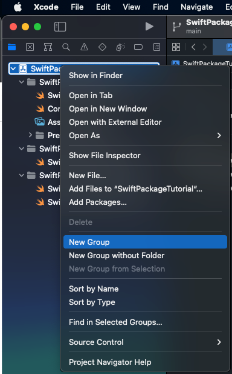

Now, the simplest way to create a Swift Package inside your project is by going to `File => New => Package…`

    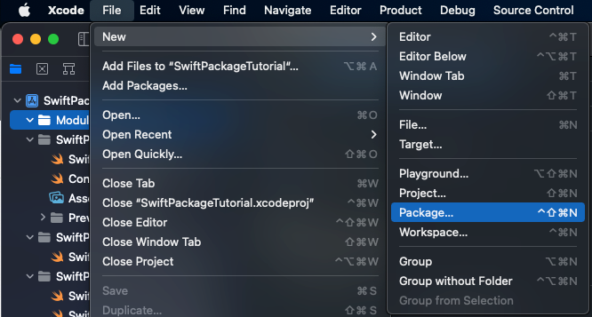

This will open a new Xcode window with the prompt to choose the name and location for your Swift Package. For this example, you can name the package **MyFirstSwiftPackage** and select your `Modules` directory. You will also need to choose your main project **SwiftPackageTutorial** (or workspace if you are using one) from the `Add to` dropdown and `Modules` group from `Group` dropdown. Click `Create` to finish.

    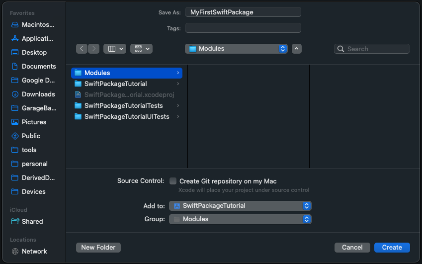

To link the newly created Swift Package with your main project, select your project’s main target (**SwiftPackageTutorial**) and under the `General` tab scroll to the `Frameworks, Libraries, and Embedded Content` section.

    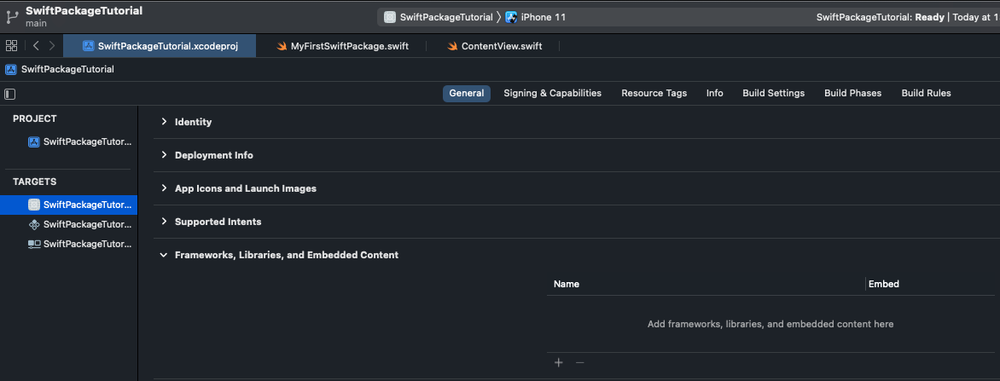

Press plus (“+”) button, choose **MyFirstSwiftPackage** static library and press `Add` to finish.

    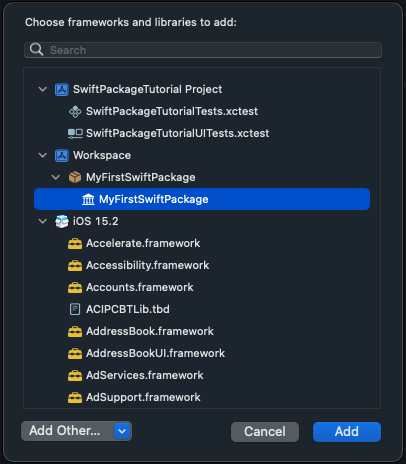

Well done! You finished creating the first Swift Package. Just make sure, if everything works fine.

To test if you can use your local Swift Package, open the main struct from the **MyFirstSwiftPackage** module and replace

`public private(set) var text = "Hello, World!"`

with

`public private(set) var text = "Hello, World from Swift Package!"`

    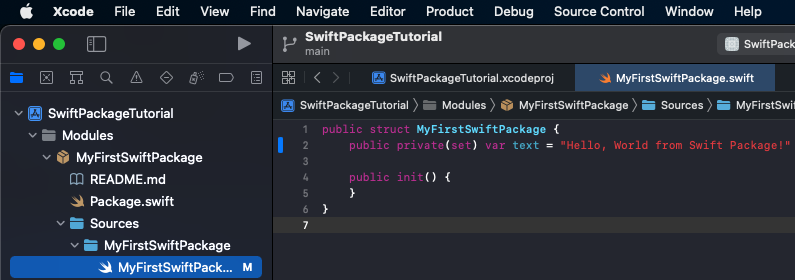

Next (if you are using SwiftUI) go to your main project’s `ContentView` struct and replace

`Text("Hello, world!")`

with

`Text(MyFirstSwiftPackage().text)`

Don’t forget to also add `import MyFirstSwiftPackage` on top of your file.

    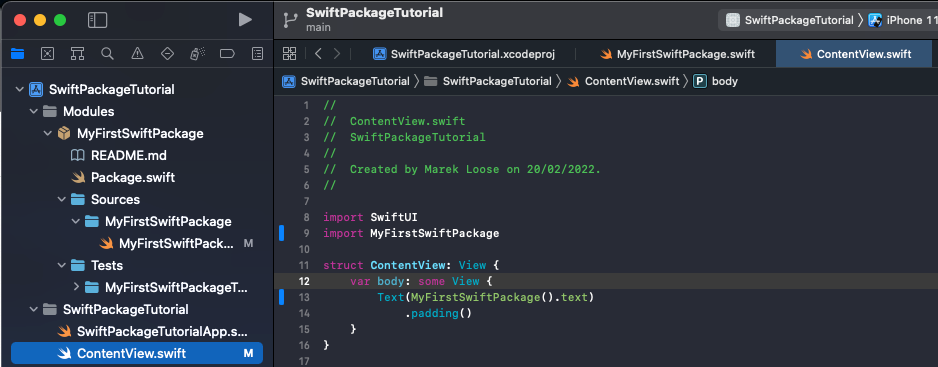

Press run or reload the preview. You should now see the text saying `"Hello, World from Swift Package!"`.

    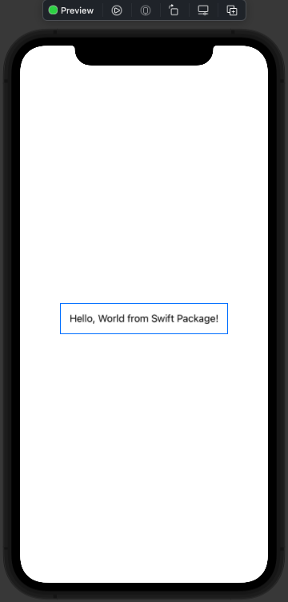

## Moving Local Swift Package to Remote

Ok, so now you have your local Swift Package included in your project. You added a bunch of files to it that create your module, but let's say, you are starting a new project where you would like to reuse that module. In just a few steps, you can extract your local Swift Package into a standalone module hosted on a separate repository.

The easiest method to separate your local Swift Package from the project is to select the package in Xcode’s project navigator panel and drag it to the desired location in Finder.

**IMPORTANT: While dragging your local Swift Package from Xcode, it’s important to press and hold the option key. This will create a copy of the package as opposed to moving it to a different location.**

    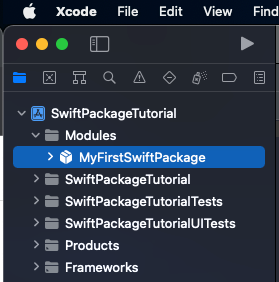

You can now double-click the `Package.swift` file from the **MyFirstSwiftPackage** to open it in Xcode.

In Xcode, go to `Source Control => New Git Repositories`

    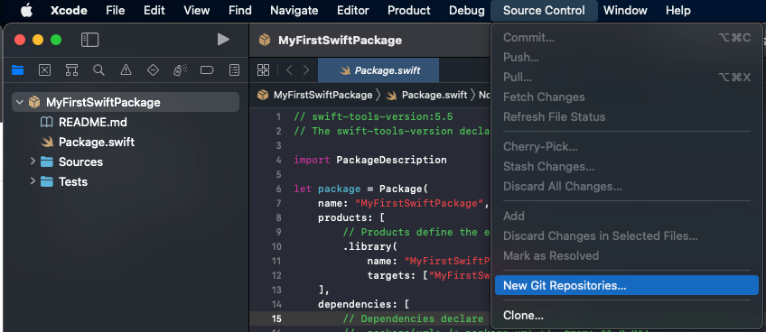

Keep **MyFirstSwiftPackage** checked and press `Create` to finish.

    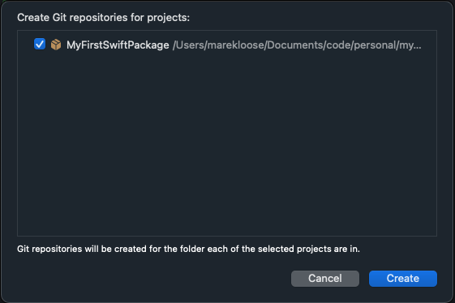

This will create a local repository with the `main` branch.

Now you can create or link a local repository with remote in any way you like - it can be through Terminal, any third-party software, or in Xcode. To finish this chapter, I will demonstrate the process when using Xcode.

In your left-hand panel, select `Show the Source Control Navigation` tab (second from the left), and then Repositories sub-tab. Right-click on the package name **MyFirstSwiftPackage** to show more options and then press the `New “MyFirstSwiftPackage” remote…` 

    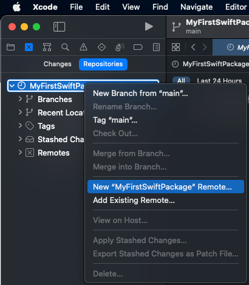

For this example, I’m using a GitHub account for hosting my remote repositories. 

    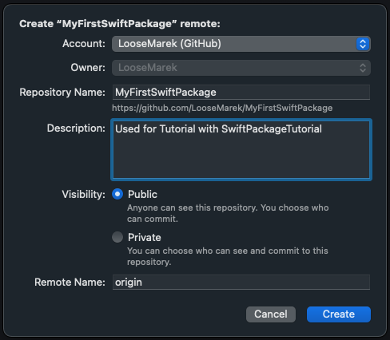

Note: If you don’t have GitHub configured in Xcode, you will need to create Personal Access Token from your GitHub Account under `Settings => Developer settings => Personal access tokens.`

## Replacing Local Swift Package with Remote

Great! Now your Swift Package is located in a separate repository. It’s time to replace your local version in the project with the remote version.

Go back to the **SwiftPackageTutorial** project and remove the local version of the **MyFirstSwiftPackage** from Project Navigation in Xcode. If you don’t have any other modules in the `Modules` group, you can also remove the folder. 

    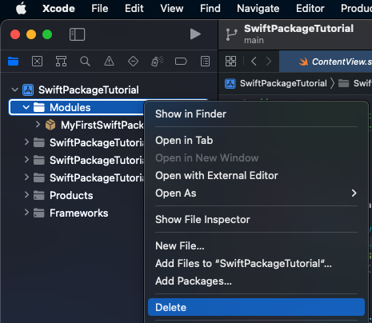

Note: Make sure you press `Move to Trash` *not* `Remove Reference` as you want to completely remove it from the repository.

Don’t forget to remove the linked static library. Go to your project’s main target (**SwiftPackageTutorial**), and under the `General` tab scroll to the `Frameworks, Libraries, and Embedded Content` section. Select **MyFirstSwiftPackage** and press the minus (“-”) button.

    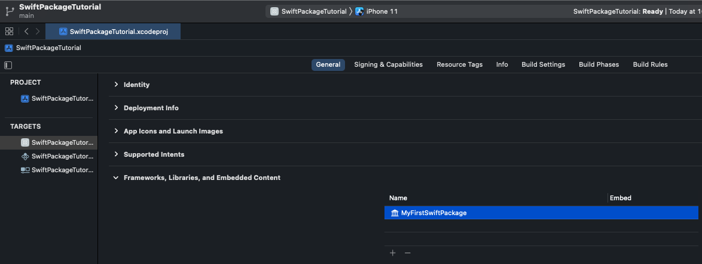

Don’t worry about the errors related to the missing module **MyFirstSwiftPackage** as you will fix it in a minute. 

Press `File => Add Packages…` to open prompt with all available Swift Packages.

    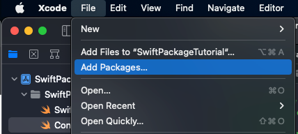

In the top-right corner, you will find the `Search or Enter Package URL` input. Copy-paste the URL of your Swift Package. For this tutorial, this will be `https://github.com/LooseMarek/MyFirstSwiftPackage`.

Since you haven’t added any version tags to the package, you can keep the default configurations for the `Dependency Rule` which is `Branch => main`, but if you added version tag already, the recommended rule is `Up to Next Major Version` (and selecting the latest version).

    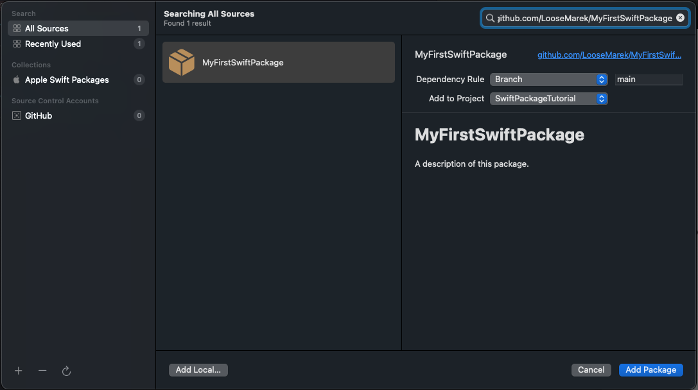

Press `Add Package` which will show you the list of available products included in the package. Keep it as is, and press `Add Package` again to finish.

    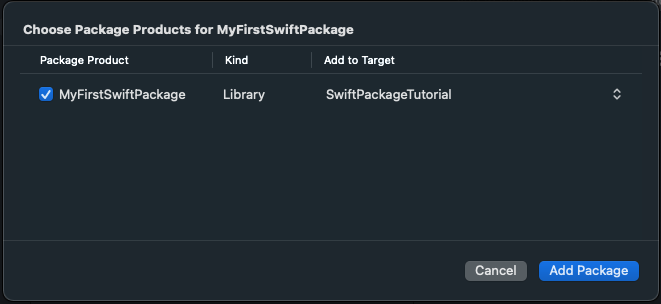

The good news is, that this will automatically add the package to `Frameworks, Libraries, and Embedded Content` so you don’t need to do it yourself.

Congrats! You now have your Swift Package hosted on the remote repository and you can use it in your main project. To verify it, you can refresh the preview or run the project and Xcode should no longer show any errors related to the missing module **MyFirstSwiftPackage**.

## Resources

- Swift Package Manager: https://www.swift.org/package-manager/
- Monolithic: https://en.wikipedia.org/wiki/Monolithic_application#:~:text=In%20software%20engineering%2C%20a%20monolithic,independent%20from%20other%20computing%20applications
- **SwiftPackageTutorial** project example: https://github.com/LooseMarek/SwiftPackageTutorial
- **MyFirstSwiftPackage** Swift Package example: https://github.com/LooseMarek/MyFirstSwiftPackage
